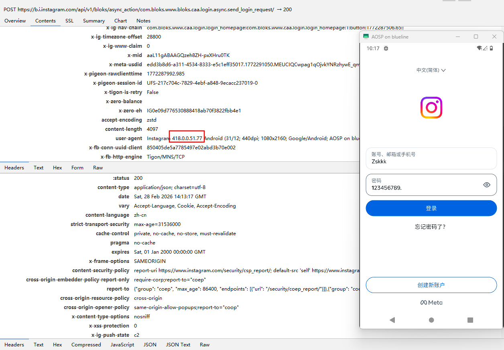

# Instagram SSL Pinning Bypass

A LSPosed/Xposed module that bypasses Instagram's SSL certificate pinning for network debugging.



## Supported Versions

**Instagram v361 - v418**

> **Note:** Versions earlier than v361 use native-level SSL verification and are not supported.

## Technical Details

```
┌─────────────────────────────────────────────────────────────┐
│                     Instagram App                           │
├─────────────────────────────────────────────────────────────┤
│  Layer 1: TigonMNSServiceHolder.initHybrid                  │
│  • Disables certificate validation                          │
│  • Trusts sandbox certificates                              │
├─────────────────────────────────────────────────────────────┤
│  Layer 2: TrustManagerImpl.checkTrustedRecursive            │
│  • Returns empty certificate chain                          │
├─────────────────────────────────────────────────────────────┤
│  Layer 3: SSLContext.init                                   │
│  • Replaces TrustManager with no-op implementation          │
└─────────────────────────────────────────────────────────────┘
```

## Development

### Building from Source

```bash
git clone https://github.com/Zskkk/InstagramSSLBypass.git
cd InstagramSSLBypass
./gradlew assembleDebug
```

### Install to Device

```bash
adb install -r app/build/outputs/apk/debug/app-debug.apk
```

**Module Info:**
- Package: `com.zsk.inssslbypass`
- Scope: `com.instagram.android`

## Disclaimer

This tool is intended for security research, network debugging, and educational purposes only.

**Do not use for unauthorized access to data or accounts.** Users are responsible for complying with local laws and Instagram's Terms of Service.

## Acknowledgments

This project is based on research and code from:
- [expectedfailure/Instagram-SSL-Pinning-Bypass-Research](https://github.com/expectedfailure/Instagram-SSL-Pinning-Bypass-Research)
- [takaotr/Android-Instagram-SSL-Pinning-Bypass](https://github.com/takaotr/Android-Instagram-SSL-Pinning-Bypass)
